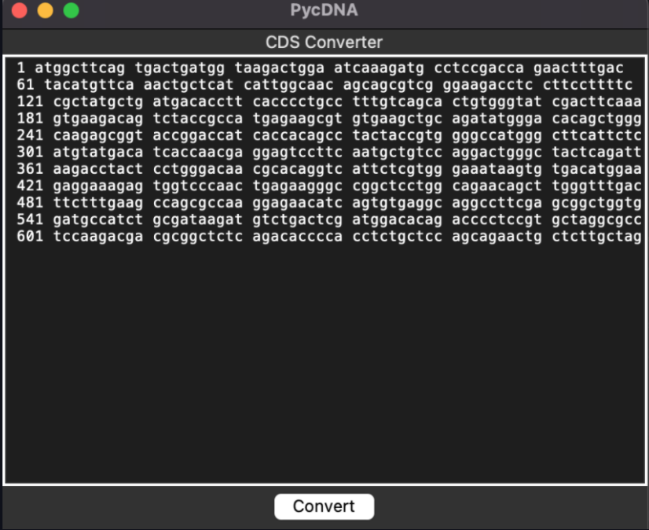

# PycDNA 


A tool for quickly converting NCBI CDS libraries to plain nucleotide sequences.

## Background
cDNA libraries are important tools in molecular biology and genomics research, providing a snapshot 
of the expressed genes in a cell or tissue under specific conditions. The information obtained from cDNA libraries can
be used to study the function of genes and their role in biological processes, disease development, and drug discovery.

NCBI provides a vast database of Coding Sequence (CD) libraries. There already exist tools to analyze and label these libraries. However, the
format in which they are provided in makes them difficult to add to these tools.

An example sequence found in `examples_cds.txt` reads:

```
1   atggcttcag tgactgatgg taagactgga atcaaagatg cctccgacca gaactttgac
61  tacatgttca aactgctcat cattggcaac agcagcgtcg ggaagacctc cttccttttc
121 cgctatgctg atgacacctt cacccctgcc tttgtcagca ctgtgggtat cgacttcaaa
181 gtgaagacag tctaccgcca tgagaagcgt gtgaagctgc agatatggga cacagctggg
241 caagagcggt accggaccat caccacagcc tactaccgtg gggccatggg cttcattctc
301 atgtatgaca tcaccaacga ggagtccttc aatgctgtcc aggactgggc tactcagatt
361 aagacctact cctgggacaa cgcacaggtc attctcgtgg gaaataagtg tgacatggaa
421 gaggaaagag tggtcccaac tgagaagggc cggctcctgg cagaacagct tgggtttgac
481 ttctttgaag ccagcgccaa ggagaacatc agtgtgaggc aggccttcga gcggctggtg
541 gatgccatct gcgataagat gtctgactcg atggacacag acccctccgt gctaggcgcc
601 tccaagacga cgcggctctc agacacccca cctctgctcc agcagaactg ctcttgctag
```

Simply copy and pasting this sequence into programs like SnapGene, which can
only read the nucleotide sequences is unreliable. 

PycDNA provides a simple user interface for stripping the numbers and spaces
from these sequences so they can be easily read into nucleotide and genome 
tools. 

## Before conversion


## After conversion
